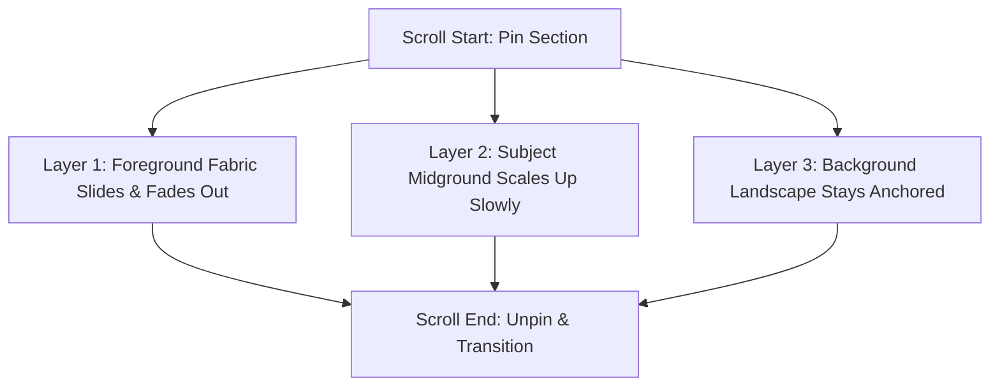
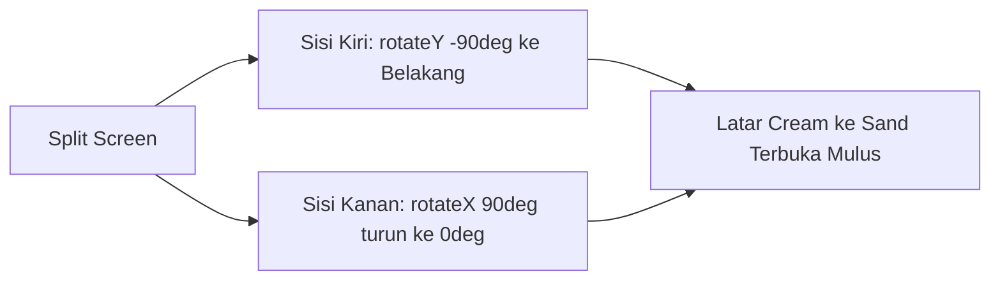

# skill.gsap — GSAP Cinematic Reference for Juicy 🍊

Panduan ini berisi **5 opsi animasi GSAP premium dan cinematic** yang dikurasi khusus untuk estetika mewah, hangat, dan editorial ala **Juicy** (terinspirasi dari *Jacquemus*). 

Semua opsi di bawah ini memprioritaskan kontrol scroll (**scrub**), kedalaman **3D**, timing **organik**, serta standar visual tingkat tinggi yang sering memenangkan penghargaan di **Awwwards** dan **FWA**.

---

## Ringkasan 5 Opsi Animasi

| Opsi | Nama Teknik GSAP | Wow Factor | Kompleksitas |
| :--- | :--- | :--- | :--- |
| **1** | **Diorama Z-Depth Dolly-In** | Menembus bidang kedalaman foto 3D (*immersive lens*) | **Hard** |
| **2** | **Origami Split-Fold Reveal** | Efek lipatan taktil 3D seperti membuka buku fisik premium | **Expert** |
| **3** | **Monolithic Typographic Roll** | Huruf monolitik berputar tegak 90° dari lantai 3D | **Medium** |
| **4** | **Floating Postcard Deck Scatter** | Hamburan kartu pos 3D yang menyatu menjadi hero spread | **Expert** |
| **5** | **Horizon Silk Curtain Warp** | Simulasi kelengkungan silinder sutra/kanvas teater melengkung | **Hard** |

---

### 1. Diorama Z-Depth Dolly-In (Scroll-Linked Z-Axis Depth Parallax)



*   **Teknik GSAP:** `ScrollTrigger Pinning` + `Staggered Z-Axis Dolly Translation (z / scale)` + `CSS Perspective`
*   **Efek Visual (Director Style):**
    > *"Bayangkan kamera format medium Arri Alexa melakukan gerakan dolly-in (maju ke depan) yang sangat lambat menembus kedalaman lookbook. Ketika section terkunci di layar (pinned), frame terbagi menjadi 3 bidang kedalaman. Foreground (misal: helaian kain linen bertekstur terracotta blur) terdorong cepat ke kiri-kanan layar seolah kamera melewatinya. Midground (model bergaun cream) membesar secara perlahan ke arah mata penonton. Background (villa terracotta di Gordes yang sun-drenched) tetap tenang di kejauhan dengan pergerakan minimal. Kedalaman 3D terasa nyata."*
*   **Wow Factor:** Mengubah foto 2D datar menjadi ruang diorama multi-dimensi. Perubahan kedalaman Z-axis yang organik memberi ilusi fisik yang sangat mahal, membawa user menjelajahi dimensi foto alih-alih hanya melihatnya.
*   **Plugin GSAP:** `ScrollTrigger`
*   **Tingkat Kompleksitas:** **Hard** (memerlukan setup `perspective`, `transform-style: preserve-3d` pada CSS, dan kalkulasi rasio translasi Z yang halus).

---

### 2. Origami Split-Fold Reveal (Dual-Axis 3D Canvas Flipping)



*   **Teknik GSAP:** `ScrollTrigger Pinning` + `Dual-Axis 3D Rotations (rotateX / rotateY)` + `Dynamic transformOrigin`
*   **Efek Visual (Director Style):**
    > *"Kamera menatap split-screen asimetris yang elegan. Saat user menscroll, separuh layar bagian kiri (berisi foto campaign Provence) berputar 90 derajat ke belakang pada sumbu Y (rotateY: -90deg) seakan halaman buku tebal yang tertutup secara anggun. Secara simultan, separuh layar kanan (berisi nama koleksi dan deskripsi dalam Playfair Display) berputar turun dari sumbu X atas (rotateX: 90deg ke 0deg) seperti penutup kotak kado Hermes yang terbuka secara teaterikal."*
*   **Wow Factor:** Melanggar hukum scroll vertikal standar dengan transisi lipatan fisik (*physical folding*). Resistansi scroll melahirkan interaksi taktil yang kokoh, membuat website terasa seperti portofolio fisik eksklusif.
*   **Plugin GSAP:** `ScrollTrigger`
*   **Tingkat Kompleksitas:** **Expert** (membutuhkan presisi tinggi pada `transform-origin` dan koordinasi sumbu rotasi agar transisi terasa mulus tanpa cela/patah).

---

### 3. Monolithic Typographic Roll (3D Letter Projection)

*   **Teknik GSAP:** `SplitText` + `3D Letter Pivot (rotateX & translateZ)` + `ScrollTrigger scrub`
*   **Efek Visual (Director Style):**
    > *"Kamera menatap kanvas cream yang kosong dan berpasir halus. Begitu scroll dimulai, huruf-huruf tipografi editorial raksasa (Playfair Display) mulai bermunculan satu per satu dengan stagger organik. Setiap huruf tidak sekadar memudar, melainkan terbaring rata di lantai 3D virtual lalu berputar tegak 90 derajat ke depan (rotateX: 90deg ke 0deg) sekaligus terdorong keluar dari kedalaman (translateZ: -150px ke 0px). Bayangan tipis di bawah setiap huruf memudar seiring tegaknya huruf."*
*   **Wow Factor:** Tipografi terasa seperti monumen arsitektural yang didirikan secara fisik di atas pasir. Efek staggered 3D pada tiap karakter memicu ketegangan sinematik yang membuat user penasaran untuk menyelesaikan kata tersebut.
*   **Plugin GSAP:** `ScrollTrigger` + `SplitText` (atau pemisahan span manual di React)
*   **Tingkat Kompleksitas:** **Medium** (setup CSS `perspective` yang bersih, memberikan dampak visual yang sangat premium dengan baris kode yang relatif ringkas).

---

### 4. Floating Postcard Deck Scatter (Perspective Fan-Out & Morph)

*   **Teknik GSAP:** `ScrollTrigger scrub` + `3D Perspective Scatter` + `GSAP Flip (Optional)`
*   **Efek Visual (Director Style):**
    > *"Di awal section, tumpukan kartu foto campaign bertumpuk acak di sudut bawah layar seperti tumpukan kartu pos tua di atas meja villa. Seiring scroll berjalan ke bawah, kartu-kartu tersebut melayang naik secara organik dan berhamburan (scatter) di ruang 3D, berputar perlahan di semua sumbu (rotateX, rotateY, rotateZ). Satu kartu utama (hero look) memisahkan diri dari rombongan, berputar mulus meluruskan diri ke arah kamera, dan perlahan membesar mengisi seluruh layar (morphing) menjadi background hero penuh di section berikutnya."*
*   **Wow Factor:** Efek hamburan acak dalam ruang 3D yang berubah menjadi layout presisi nan simetris. Ini merusak batas layout grid kaku tradisional dan memberikan transisi mulus dari elemen dinamis menjadi struktur halaman statis.
*   **Plugin GSAP:** `ScrollTrigger` + `Flip` (untuk interpolasi layout dari tumpukan absolut ke full-screen grid)
*   **Tingkat Kompleksitas:** **Expert** (membutuhkan interpolasi rotasi multi-axis dan pencocokan koordinat global agar tidak terjadi flicker/patah saat morphing).

---

### 5. Horizon Silk Curtain Warp (3D Curvature & Mesh Warp)

*   **Teknik GSAP:** `ScrollTrigger scrub` + `3D Spherical Distortion (rotateY, skewX & scale)` + `Canvas Depth Shadow`
*   **Efek Visual (Director Style):**
    > *"Section baru tidak sekadar menutupi section sebelumnya; ia muncul dari bawah layar dengan kelengkungan silindris cembung layaknya lembaran tirai sutra tebal yang ditarik melengkung melintasi panggung teater (rotateY: 15deg, skewX: -5deg melurus ke 0). Tepi-tepi gambar memiliki bayangan gradien gelap yang perlahan memudar menjadi terang benderang saat lembaran tersebut sejajar lurus dengan mata penonton."*
*   **Wow Factor:** Memberi ilusi kelengkungan fisik (*physical curvature*) pada permukaan layar datar. Keberadaan bayangan kedalaman (*depth shadow*) dinamis di tepi kanvas menyulap piksel menjadi material fisik yang bergerak lentur.
*   **Plugin GSAP:** `ScrollTrigger`
*   **Tingkat Kompleksitas:** **Hard** (memerlukan sinkronisasi opacity gradien bayangan dengan derajat rotasi/skew 3D secara bersamaan saat scroll di-scrub).

---

## 🛠️ Blueprint Implementasi: Diorama Z-Depth Dolly-In

Berikut adalah blueprint kode komponen React (TypeScript) untuk **Diorama Z-Depth Dolly-In** yang terintegrasi sempurna dengan setup Next.js + GSAP + ScrollTrigger Anda, serta mematuhi aturan ketat arsitektur Anda (Arrow Component, Props Type, absolute imports, no raw HTML, and type-safety).

### `@/components/sections/DioramaSection.tsx`

```tsx
"use client";

import { useEffect, useRef } from "react";
import gsap from "gsap";
import { ScrollTrigger } from "gsap/dist/ScrollTrigger";
import { Button } from "@/components/ui/button"; // Menggunakan UI Component bawaan project Anda
import { Sparkles } from "lucide-react";

// Registrasi ScrollTrigger secara aman di Next.js (Client-Side)
if (typeof window !== "undefined") {
  gsap.registerPlugin(ScrollTrigger);
}

// Props Type definition (Menggunakan type, bukan interface sesuai aturan Anda)
type DioramaSectionProps = {
  subtitle?: string;
  title: string;
  description: string;
  ctaText?: string;
  ctaHref?: string;
  foregroundImg: string;
  midgroundImg: string;
  backgroundImg: string;
};

export const DioramaSection = ({
  subtitle = "Atelier Collection",
  title,
  description,
  ctaText = "Acquire Dynamic Piece",
  ctaHref = "#",
  foregroundImg,
  midgroundImg,
  backgroundImg,
}: DioramaSectionProps) => {
  const containerRef = useRef<HTMLDivElement>(null);
  const dioramaRef = useRef<HTMLDivElement>(null);
  const fgRef = useRef<HTMLDivElement>(null);
  const mgRef = useRef<HTMLDivElement>(null);
  const bgRef = useRef<HTMLDivElement>(null);
  const textRef = useRef<HTMLDivElement>(null);

  useEffect(() => {
    const container = containerRef.current;
    const diorama = dioramaRef.current;
    const fg = fgRef.current;
    const mg = mgRef.current;
    const bg = bgRef.current;
    const text = textRef.current;

    if (!container || !diorama || !fg || !mg || !bg || !text) return;

    // Timeline GSAP dengan ScrollTrigger Scrub
    const tl = gsap.timeline({
      scrollTrigger: {
        trigger: container,
        start: "top top",
        end: "+=150%", // Menentukan panjang durasi scroll scrubbing
        scrub: 1.2,    // Memberikan kelembutan interpolasi gerakan (smooth lag)
        pin: true,     // Mengunci section saat scroll sedang berlangsung
        anticipatePin: 1,
      },
    });

    // Animasi Diorama Z-depth
    tl.to(
      fg,
      {
        z: 400,            // Mendorong foreground melintasi kamera 3D
        opacity: 0,        // Memudarkan foreground saat ia sangat dekat dengan kamera
        ease: "power2.inOut",
      },
      0
    )
      .to(
        mg,
        {
          z: 80,           // Sedikit mencondongkan subjek ke depan kamera (dolly-in)
          scale: 1.05,
          ease: "power2.inOut",
        },
        0
      )
      .to(
        bg,
        {
          scale: 1.08,     // Background membesar tipis untuk mengimbangi paralaks
          ease: "power2.inOut",
        },
        0
      )
      .fromTo(
        text,
        {
          y: 60,
          opacity: 0,
        },
        {
          y: 0,
          opacity: 1,
          duration: 0.6,
          ease: "power3.out",
        },
        "-=0.4" // Muncul sedikit sebelum gerakan 3D selesai
      );

    return () => {
      // Membersihkan instance ScrollTrigger untuk menghindari memory leak saat unmount
      ScrollTrigger.getAll().forEach((trigger) => trigger.kill());
    };
  }, []);

  return (
    <div
      ref={containerRef}
      className="relative w-full h-screen overflow-hidden bg-background select-none"
      style={{ perspective: "1000px" }} // Memberikan kedalaman 3D perspective pada parent container
    >
      {/* 3D Diorama Stage */}
      <div
        ref={dioramaRef}
        className="absolute inset-0 w-full h-full transform-gpu"
        style={{ transformStyle: "preserve-3d" }}
      >
        {/* Layer 3: Background (Paling Belakang) */}
        <div
          ref={bgRef}
          className="absolute inset-0 w-full h-full transform-gpu origin-center scale-100"
          style={{ transform: "translateZ(-150px)" }}
        >
          
          <div className="absolute inset-0 bg-gradient-to-t from-soil/45 via-transparent to-transparent" />
        </div>

        {/* Layer 2: Midground (Model Utama) */}
        <div
          ref={mgRef}
          className="absolute inset-0 w-full h-full flex items-center justify-center transform-gpu"
          style={{ transform: "translateZ(0px)" }}
        >
          <div className="w-[85%] sm:w-[60%] lg:w-[40%] aspect-[3/4] overflow-hidden border border-sand/20 rounded-[2px] shadow-2xl">
            
          </div>
        </div>

        {/* Layer 1: Foreground (Linen / Detail Terdekat yang Blur) */}
        <div
          ref={fgRef}
          className="absolute inset-0 w-full h-full pointer-events-none transform-gpu flex justify-between items-end p-8"
          style={{ transform: "translateZ(200px)" }}
        >
          <div className="w-[30%] aspect-[3/4] -mb-16 -ml-16 overflow-hidden rounded-[2px] blur-sm opacity-90">
            
          </div>
          <div className="w-[25%] aspect-[3/4] -mb-12 -mr-12 overflow-hidden rounded-[2px] blur-[3px] opacity-80">
            
          </div>
        </div>
      </div>

      {/* Editorial Content Overlay (Muncul di akhir scroll-scrub) */}
      <div className="absolute inset-x-0 bottom-0 w-full p-8 sm:p-12 lg:p-16 z-20 flex flex-col md:flex-row items-end justify-between gap-6 pointer-events-none">
        <div ref={textRef} className="max-w-xl flex flex-col gap-4 pointer-events-auto bg-chalk/90 backdrop-blur-md p-6 sm:p-8 border border-sand/20 rounded-[2px] shadow-lg">
          <div>
            <span className="text-[10px] font-bold uppercase tracking-[0.3em] text-terracotta flex items-center gap-1.5 mb-2">
              <Sparkles className="size-3" />
              {subtitle}
            </span>
            <h2 className="font-playfair text-2xl sm:text-3xl lg:text-4xl font-normal text-soil leading-tight">
              {title}
            </h2>
          </div>
          
          <p className="text-xs text-dust leading-relaxed">
            {description}
          </p>

          <div className="mt-2">
            <Button
              variant="primary"
              size="default"
              className="text-[9px] font-bold uppercase tracking-widest px-6 py-2.5"
              onClick={() => {
                window.location.href = ctaHref;
              }}
            >
              {ctaText}
            </Button>
          </div>
        </div>
      </div>
    </div>
  );
};
